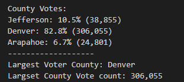
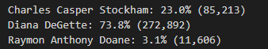

# Election Analysis

## Project  Overview

A Colorado Board of Elections has requested the following tasks to be completed in regards to an election audit of a recent congressional election.

Calculate the total number of votes cast.

Get a complete list of candidates who received votes.

Calculate the total number of votes each candidate received.

Calculate the percentage of votes each candidate wone.

Determine the winner of the election based on the popular vote.

Determine the voter turnout for each county.

Calculate the percentage from each county out of the total count.

Determine the count with the highest voter turnout.

## Resources

Data Source: election_results.csv

Software: Python 3.7.6, Visual Studio Code 1.60.0

## Summary of Findings

The county analysis of the election shows that:

* There were 369,711 votes cast in the election.
* There were three counties feeding votes into the election:
	* Jefferson
	* Denver
	* Arapahoe
Their breakdown of voter turnout and contribution percentage is shown below:

The county with the largest number of contributing votes is Denver.

The candidate analysis of the election shows that:

* There were 369,711 votes cast in the election.

* The candidates were:

	* Diana DeGette
	
	* Charles Casper
	
	* Raymon Anthony Doane
	
The breakdown of votes and percentage of votes recieved is shown below:

The winner of the election was Diana DeGette who received 73.8% of the vote with 272,892 votes.

## Election Audit Summary

This Election Audit can be applied to any election held with the simple replacement of data in the same format for any number of counties or candidates.

The code can also be altered to suit any geographical nominal data (zip codes, cities, states). If zip code data were available, it could give more insight into local election turnouts and determine which areas are underrepresented in comparison with voter turnout.

The script could also be edited to include an if statement to show if certain regions are below a certain voter turnout percentage in comparison with eligible vote population (if the data be available) to target the areas with low voter turn out. 

If eligible voter population were to be available, the additional code could be added.

